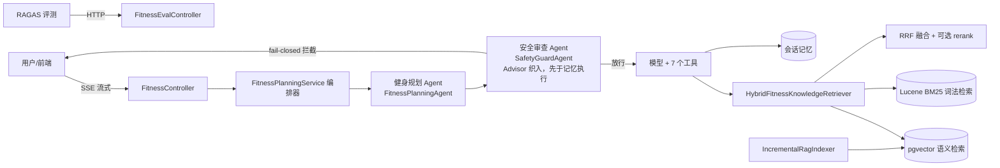

# FitPlan RAG

基于 RAG 的中文循证健身问答与个性化训练计划生成系统：后端 Spring Boot + Spring AI + PostgreSQL(pgvector)，前端 Vue 3，评测使用 RAGAS。核心采用**双 Agent 架构**：健身规划 Agent + 安全审查 Agent。

> [!IMPORTANT]
> 本项目仅用于教育、研究和软件演示，不构成医疗诊断、治疗建议或个体化医疗意见。AI 输出可能不完整或不准确，不能替代医生、注册营养师或合格教练。出现胸痛、呼吸困难、意识异常等紧急症状时，请立即联系当地急救服务。使用者应根据自身健康状况审慎运动并自行承担风险。

## 功能特性

- **双 Agent 架构**：健身规划 Agent（Function Calling 多步工具调用循环，7 个工具：知识检索 / 用户画像 / 训练日志 / 计划摘要）+ 安全审查 Agent（工具调用型：checkRedFlagRules 规则引擎 + classifyRisk LLM 分类器双层兜底）。两个 Agent 通过 AgentRegistry 注册，GET /api/ai/agents 可查看公开元数据
- **混合检索**：pgvector 语义检索 + Lucene BM25 中文词法检索 + RRF 融合 + 可选 Qwen rerank 重排
- **增量索引**：内容哈希比对 + 数据库租约锁 + 索引任务记录，只重建发生变化的文档
- **安全审查**：命中风险先于模型与会话记忆 fail-closed 拦截——不进模型、不入聊天记忆
- **自动化评测**：RAGAS 四指标（Faithfulness / Answer Relevancy / Context Precision / Context Recall），69 条评测用例
- **可观测性**：Micrometer + Prometheus 指标、Actuator 健康检查、Flyway 迁移

## 技术栈

| 层 | 技术 |
| --- | --- |
| 后端 | Java 21 · Spring Boot 4.1 · Spring AI 2.0 · Spring MVC |
| 存储 | PostgreSQL 16 + pgvector · Flyway |
| 模型 | 阿里云 DashScope：qwen3.7-flash（生成/分类）· text-embedding-v3（向量）· qwen3-rerank（可选重排） |
| 前端 | Vue 3 · Vite |
| 评测 | RAGAS 0.2.x · LangChain · 69 条用例（检索 40 / 生成 29） |

## 双 Agent 设计

- **健身规划 Agent**（agent/FitnessPlanningAgent.java）：基于 Function Calling 的多步工具调用循环，模型自主决定何时调用 7 个工具（知识检索、用户画像、训练日志、计划摘要），支持多轮对话与 SSE 流式输出，回答末尾自动回显工具执行轨迹与知识来源。
- **安全审查 Agent**（agent/SafetyGuardAgent.java）：工具调用型——暴露 checkRedFlagRules（确定性红旗规则引擎）与 classifyRisk（LLM 风险分类器）两个工具，Agent 循环按确定性策略先规则、后分类器，输出 SAFE / CLARIFY / MEDICAL_BOUNDARY / URGENT。以 FitnessRiskAdvisor 形式织入规划 Agent 的调用链并先于会话记忆执行，命中风险 fail-closed 拦截（不进模型、不入记忆）。
- 两个 Agent 均实现 Agent 接口并通过 AgentRegistry 注册，GET /api/ai/agents 返回其 id、名称、职责与工具列表。系统提示词只保留在服务端，不通过公共接口返回。

## 架构



## 快速开始

### 环境要求

- JDK 21 · Maven 3.9+
- PostgreSQL 16 + pgvector（可用 Docker）
- Node.js 18+ 与 pnpm（仅前端需要）
- 阿里云 DashScope API Key

### 1. 配置环境变量

复制 `.env.example` 为 `.env`，设置 DashScope API Key，并将数据库密码改为本地强密码。`.env` 已被 Git 忽略：

```powershell
Copy-Item .env.example .env
```

### 2. 启动数据库

```bash
docker compose up -d
```

### 3. 启动后端

```powershell
start.bat
# 或 mvn spring-boot:run
```

首次使用需要建立向量索引：设置环境变量 FITPLAN_RAG_INDEX_ON_STARTUP=true 后启动，等待日志出现索引完成记录。

### 4. 启动前端（可选）

```bash
cd frontend
pnpm install
pnpm dev
```

浏览器访问 http://localhost:3000。

### 查看两个 Agent

```bash
curl http://localhost:8123/api/ai/agents
```

返回健身规划 Agent 与安全审查 Agent 的 id、名称、职责与工具列表。

## 环境变量

| 变量 | 说明 | 默认值 |
| --- | --- | --- |
| DASHSCOPE_API_KEY | DashScope API Key（必填） | - |
| DASHSCOPE_BASE_URL | OpenAI 兼容端点 | https://dashscope.aliyuncs.com/compatible-mode/v1 |
| DASHSCOPE_CHAT_MODEL | 对话模型 | qwen3.7-flash |
| DASHSCOPE_EMBEDDING_MODEL | 向量模型 | text-embedding-v3 |
| DASHSCOPE_RISK_MODEL | 风险分类模型 | qwen3.7-flash |
| FITPLAN_RAG_INDEX_ON_STARTUP | 启动时重建索引 | false |
| FITPLAN_RAG_QUERY_REWRITE_ENABLED | 检索前使用 LLM 改写口语化问题 | true |
| FITPLAN_RAG_RERANK_ENABLED | 启用重排 | false |
| DASHSCOPE_RERANK_BASE_URL | 重排服务地址 | 空 |
| FITPLAN_RISK_CLASSIFIER_ENABLED | 启用 LLM 风险分类器 | false |
| DB_URL / DB_USERNAME | PostgreSQL 连接 | localhost:5432/fitplan |
| DB_PASSWORD | PostgreSQL 密码（必填） | - |
| FITPLAN_CORS_ALLOWED_ORIGINS | 允许访问 API 的前端来源，逗号分隔 | localhost:3000 |
| MANAGEMENT_ENDPOINTS_WEB_EXPOSURE_INCLUDE | 可公开的 Actuator 端点 | health,info |

## 评测

### 一键评测（Windows）

```powershell
.\run-eval.ps1
```

脚本会依次：编译后端、后台启动 Spring Boot、探测健康检查、调用评测接口、运行 RAGAS 并生成报告。

### 手动评测

```powershell
mvn spring-boot:run -Dspring-boot.run.profiles=local,evaluation
cd eval
pip install -e .
python ragas_evaluate.py --dataset datasets/retrieval-eval.tsv --mode retrieval
python ragas_evaluate.py --dataset datasets/generation-eval.tsv --mode generation
```

报告输出到 eval/reports/<时间戳>/。

## 项目结构

```text
fitplan-rag/
├── src/main/java/com/fitplan/rag/
│   ├── agent/        # 双 Agent：Agent 接口、AgentRegistry、FitnessPlanningAgent、SafetyGuardAgent
│   ├── controller/   # REST API（含 /ai/agents 展示两个 Agent）
│   ├── config/       # CORS、属性、线程池等配置
│   ├── knowledge/    # 文档加载、增量索引、混合检索、重排
│   ├── safety/       # 风险审查（规则引擎 + LLM 分类器 + Advisor 适配器）
│   └── service/      # 编排器、Agent 工具、会话状态、评测与生成服务
├── src/main/resources/db/migration/  # Flyway 迁移
├── src/test/                         # 单元测试与集成测试
├── Data/knowledge-base/              # 可再分发 Markdown 语料（49 篇，含来源/许可元数据）
├── eval/                             # RAGAS 评测脚本与数据集
└── frontend/                         # Vue 3 前端
```

## 知识库与来源管理

公开语料统一为 Markdown 格式，位于 `Data/knowledge-base/`，由美国 ODPHP、NIH 和英国政府官方公开资料机器翻译而来。每个文件头部带有 YAML 前置元数据（publisher、canonical_url、license_id、rights_status 等），加载器会做白名单与版权校验，未获许可或来源不明的文档直接拒绝入库（fail-closed）。详细来源、署名要求和许可边界见 [DATA_LICENSES.md](DATA_LICENSES.md)。

HPRC/USU 与 Dietary Guidelines 翻译语料未包含在公开仓库中：前者尚缺少明确的翻译再分发授权，后者等待许可记录复核。它们不会被默认索引，也不属于本项目的开源发行物。

## 部署安全

默认配置面向本地开发，不应未经加固直接暴露到公网：

- 生产环境必须将 `FITPLAN_CORS_ALLOWED_ORIGINS` 设置为真实前端域名，禁止使用通配符。
- `/api/ai/fitness/eval` 仅在启用 `evaluation` profile 时注册；生产环境不得启用该 profile。
- 系统提示词不会通过 `/api/ai/agents` 返回。
- 默认仅公开 Actuator 的 `health` 与 `info`；Prometheus 需要显式启用并由网关限制访问。
- 公网服务还应在反向代理或应用层增加身份认证、请求限流、配额和审计日志。
- 安全问题请按 [SECURITY.md](SECURITY.md) 私下报告，不要在公开 Issue 中粘贴密钥或健康信息。

## 许可证

项目源代码采用 [Apache License 2.0](LICENSE)。知识语料不统一适用代码许可证，分别遵循 [DATA_LICENSES.md](DATA_LICENSES.md) 中列出的原始来源条款与署名要求。

## 常见问题

- **如何重建索引**：设置 FITPLAN_RAG_INDEX_ON_STARTUP=true 后重启应用。
- **如何启用重排**：配置 DASHSCOPE_RERANK_BASE_URL 并将 FITPLAN_RAG_RERANK_ENABLED 设为 true。
- **如何启用 LLM 风险分类器**：确认模型可用后设置 FITPLAN_RISK_CLASSIFIER_ENABLED=true。
- **评测接口 500**：确认后端以 local,evaluation profile 启动，并检查后端日志。
- **本地库迁移版本与仓库不一致**：若旧版本地库记录过已删除的迁移，请执行 flyway repair 或重建数据库（docker compose down -v && docker compose up -d）。

## Roadmap

- 用户画像 / 训练记录 / 计划摘要由内存态迁移到 PostgreSQL 持久化
- 补充 Dockerfile 与应用容器化部署
- 扩展评测数据集覆盖更多健身场景
- 为 Agent 增加可视化执行轨迹（工具调用树）与人工接管（human-in-the-loop）能力
